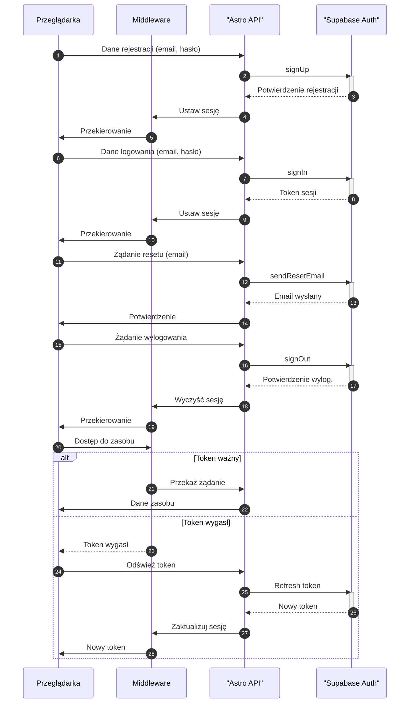

<authentication_analysis>

1. Przepływy autentykacji:
   a. Rejestracja: Użytkownik wysyła dane (email, hasło) do strony rejestracji. Dane są przesyłane do Astro API,
   które komunikuje się z Supabase Auth w celu utworzenia konta. Po pozytywnej odpowiedzi, sesja jest inicjowana.
   b. Logowanie: Użytkownik wprowadza dane logowania. Astro API wysyła je do Supabase Auth w celu weryfikacji,
   otrzymuje token sesyjny, a Middleware weryfikuje autentyczność przed przekierowaniem.
   c. Odzyskiwanie hasła: Użytkownik przesyła email poprzez formularz resetu hasła. Astro API przekazuje żądanie do
   Supabase Auth, który wysyła email z instrukcjami resetu.
   d. Wylogowanie: Użytkownik inicjuje żądanie wylogowania. Astro API wywołuje metodę signOut w Supabase Auth,
   a Middleware czyści sesję i przekierowuje użytkownika.
2. Aktorzy:
   - Przeglądarka: Interfejs użytkownika, wysyłanie żądań i odbiór odpowiedzi.
   - Middleware: Weryfikacja sesji i autentykacji.
   - Astro API: Warstwa komunikacji między frontendem a Supabase Auth.
   - Supabase Auth: System zarządzania użytkownikami, obsługa rejestracji, logowania, wylogowania i resetu hasła.
3. Weryfikacja tokenu:
   - Middleware sprawdza ważność tokenu przy każdym żądaniu.
   - W przypadku wygasłego tokenu, system inicjuje proces odświeżania lub wymusza ponowne logowanie.
4. Opis kroków:
   a. Użytkownik inicjuje akcję (rejestracja, logowanie, reset hasła, wylogowanie).
   b. Dane są przesyłane do Astro API, który komunikuje się z Supabase Auth.
   c. Middleware zarządza sesją i przekierowaniami na podstawie odpowiedzi.
   </authentication_analysis>

<mermaid_diagram>

</mermaid_diagram>
