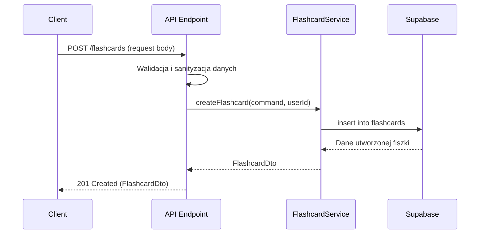

# API Endpoint Implementation Plan: POST /flashcards

## 1. Przegląd punktu końcowego

Endpoint POST /flashcards umożliwia tworzenie nowych fiszek (flashcards) na trzy sposoby: ręcznie przez użytkownika, w pełni wygenerowanych przez AI lub wygenerowanych przez AI i edytowanych przez użytkownika. Tworzy nowy rekord w tabeli `flashcards` i zwraca szczegóły utworzonej fiszki.

## 2. Szczegóły żądania

- **Metoda HTTP**: POST
- **Struktura URL**: `/flashcards`
- **Parametry**: Brak parametrów URL
- **Request Body**:
  ```json
  {
    "title": "string",
    "front": "string",
    "back": "string",
    "tags": ["string"],
    "source": "ai_full" | "ai_edited" | "manual"
  }
  ```
  - Wymagane pola: `title`, `front`, `back`, `source`
  - Opcjonalne pola: `tags` (domyślnie pusta tablica), `generation_id` (tylko dla `source` = 'ai_full' lub 'ai_edited')
- **Nagłówki**:
  - `Content-Type: application/json`

## 3. Wykorzystywane typy

W implementacji należy wykorzystać następujące typy zdefiniowane w `src/types.ts`:

```typescript
// Istniejący typ Source
export type Source = 'ai_full' | 'ai_edited' | 'manual';

// Rozszerzona wersja CreateFlashcardCommand
export interface CreateFlashcardCommand extends Omit<FlashcardInsert, 'user_id' | 'id' | 'created_at' | 'updated_at'> {
  source: Source; // Zmiana z 'manual' na typ Source
  generation_id?: string; // Opcjonalne dla 'ai_full' i 'ai_edited'
}

// Dane wyjściowe
export type FlashcardDto = Pick<
  Flashcard,
  'id' | 'title' | 'front' | 'back' | 'tags' | 'source' | 'created_at' | 'updated_at' | 'generation_id'
>;
```

## 4. Szczegóły odpowiedzi

- **Kod sukcesu**: 201 Created
- **Struktura odpowiedzi**:
  ```json
  {
    "id": "UUID",
    "title": "string",
    "front": "string",
    "back": "string",
    "tags": ["string"],
    "source": "manual" | "ai_full" | "ai_edited",
    "created_at": "ISO8601 timestamp",
    "updated_at": "ISO8601 timestamp",
    "generation_id": null | "UUID"
  }
  ```
- **Kody błędów**:
  - 400 Bad Request - nieprawidłowe dane wejściowe
  - 401 Unauthorized - brak uwierzytelnienia
  - 500 Internal Server Error - błąd wewnętrzny serwera

## 5. Przepływ danych

1. Żądanie trafia do endpointu POST `/flashcards`
2. Walidacja danych wejściowych za pomocą Zod
3. Sanityzacja danych wejściowych
4. Wywołanie FlashcardService.createFlashcard()
5. Zapisanie fiszki w bazie danych
6. Zwrócenie szczegółów utworzonej fiszki



## 6. Względy bezpieczeństwa

1. **Uwierzytelnianie**: Dostęp do endpointu tylko dla uwierzytelnionych użytkowników, wykorzystując middleware Astro
2. **Autoryzacja**: Użytkownik może tworzyć fiszki tylko dla siebie (user_id jest przypisywany automatycznie)
3. **Walidacja danych**:
   - Maksymalna długość 'front': 200 znaków
   - Maksymalna długość 'back': 500 znaków
   - Wartość 'source' musi być jedną z: 'ai_full', 'ai_edited', 'manual'
   - Sanityzacja wszystkich danych wejściowych by zapobiec XSS i SQL Injection
4. **Row-Level Security**: Wykorzystanie RLS Supabase, by zapewnić, że użytkownicy mogą zarządzać tylko swoimi fiszkami

## 7. Obsługa błędów

1. **Walidacja danych**:

   - Przekroczenie maksymalnej długości 'front' (200 znaków) - 400 Bad Request
   - Przekroczenie maksymalnej długości 'back' (500 znaków) - 400 Bad Request
   - Niewłaściwa wartość 'source' - 400 Bad Request
   - Brak wymaganych pól - 400 Bad Request
   - Nieprawidłowy format danych - 400 Bad Request
   - Źródło 'ai_full' lub 'ai_edited' bez podania 'generation_id' - 400 Bad Request

2. **Błędy autentykacji**:

   - Brak tokenu JWT - 401 Unauthorized
   - Nieważny token JWT - 401 Unauthorized

3. **Błędy bazy danych**:

   - Błąd podczas tworzenia rekordu - 500 Internal Server Error
   - Błąd spójności danych - 500 Internal Server Error

4. **Inne błędy**:
   - Nieoczekiwane wyjątki - 500 Internal Server Error

## 8. Rozważania dotyczące wydajności

1. Indeks na kolumnie `user_id` w tabeli `flashcards` dla szybkiego filtrowania
2. Skuteczna walidacja danych wejściowych przez Zod przed wykonaniem operacji na bazie
3. Optymalizacja zapytań do bazy danych przez pobieranie tylko niezbędnych kolumn
4. Logowanie błędów bez blokowania odpowiedzi API

## 9. Etapy wdrożenia

1. **Utworzenie usługi FlashcardService**:

   - Implementacja metody `createFlashcard` w nowym pliku `src/lib/services/flashcard.service.ts`
   - Implementacja obsługi błędów i logiki biznesowej

2. **Aktualizacja typów DTO**:

   - Zaktualizowanie typu `CreateFlashcardCommand` w `src/types.ts` aby wspierał wszystkie trzy źródła fiszek

3. **Implementacja endpointu**:

   - Utworzenie pliku `src/pages/api/flashcards.ts`
   - Implementacja handlera dla metody POST
   - Konfiguracja schemy walidacyjnej Zod

4. **Testy**:

   - Testy jednostkowe dla FlashcardService
   - Testy integracyjne dla endpointu API

5. **Dokumentacja**:
   - Aktualizacja dokumentacji API
   - Dodanie przykładów użycia

## 10. Przykładowa implementacja

### Schema walidacyjna (Zod)

```typescript
const createFlashcardSchema = z
  .object({
    title: z.string().min(1, 'Title is required'),
    front: z.string().min(1, 'Front content is required').max(200, 'Front content cannot exceed 200 characters'),
    back: z.string().min(1, 'Back content is required').max(500, 'Back content cannot exceed 500 characters'),
    tags: z.array(z.string()).default([]),
    source: z.enum(['ai_full', 'ai_edited', 'manual']),
    generation_id: z
      .string()
      .uuid()
      .optional()
      .transform((val) => (val === '' ? undefined : val)),
  })
  .refine(
    (data) => {
      // Jeśli source to 'ai_full' lub 'ai_edited', generation_id jest wymagane
      if (['ai_full', 'ai_edited'].includes(data.source) && !data.generation_id) {
        return false;
      }
      return true;
    },
    {
      message: "generation_id is required when source is 'ai_full' or 'ai_edited'",
      path: ['generation_id'],
    }
  );
```

### Implementacja FlashcardService

```typescript
export class FlashcardService {
  constructor(private readonly supabaseClient: SupabaseClient<Database>) {}

  async createFlashcard(command: CreateFlashcardCommand, userId: string): Promise<FlashcardDto> {
    try {
      // Przygotowanie danych do zapisania
      const flashcardData: FlashcardInsert = {
        ...command,
        user_id: userId,
      };

      // Zapisanie do bazy danych
      const { data, error } = await this.supabaseClient.from('flashcards').insert(flashcardData).select().single();

      if (error) {
        throw new Error(`Failed to create flashcard: ${error.message}`);
      }

      if (!data) {
        throw new Error('Flashcard was not created');
      }

      // Zwrócenie DTO
      return {
        id: data.id,
        title: data.title,
        front: data.front,
        back: data.back,
        tags: data.tags,
        source: data.source,
        created_at: data.created_at,
        updated_at: data.updated_at,
        generation_id: data.generation_id,
      };
    } catch (error) {
      console.error('Error in createFlashcard:', error);
      throw error;
    }
  }
}
```

### Implementacja endpointu API

```typescript
// src/pages/api/flashcards.ts
import { z } from 'zod';
import type { APIRoute } from 'astro';
import type { CreateFlashcardCommand, FlashcardDto } from '../../types';
import { FlashcardService } from '../../lib/services/flashcard.service';

export const prerender = false;

export const POST: APIRoute = async ({ request, locals }) => {
  try {
    // 1. Pobranie i walidacja danych wejściowych
    const body = await request.json();
    const validationResult = createFlashcardSchema.safeParse(body);

    if (!validationResult.success) {
      return new Response(
        JSON.stringify({
          error: 'Invalid input',
          details: validationResult.error.errors,
        }),
        {
          status: 400,
          headers: { 'Content-Type': 'application/json' },
        }
      );
    }

    // 2. Pobranie ID użytkownika z kontekstu
    const userId = locals.supabase.auth.user()?.id;
    if (!userId) {
      return new Response(
        JSON.stringify({
          error: 'Unauthorized',
          message: 'Authentication required',
        }),
        {
          status: 401,
          headers: { 'Content-Type': 'application/json' },
        }
      );
    }

    // 3. Utworzenie fiszki przez serwis
    const flashcardService = new FlashcardService(locals.supabase);
    const result = await flashcardService.createFlashcard(validationResult.data, userId);

    // 4. Zwrócenie odpowiedzi
    return new Response(JSON.stringify(result), {
      status: 201,
      headers: { 'Content-Type': 'application/json' },
    });
  } catch (error) {
    console.error('Error processing flashcard creation request:', error);

    return new Response(
      JSON.stringify({
        error: 'Internal server error',
        message: error instanceof Error ? error.message : 'Unknown error occurred',
      }),
      {
        status: 500,
        headers: { 'Content-Type': 'application/json' },
      }
    );
  }
};
```
